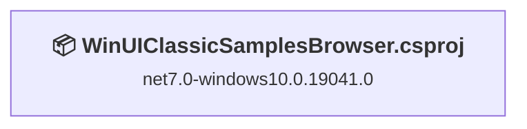
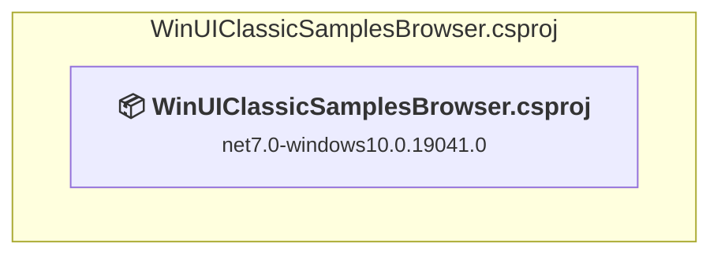

# Projects and dependencies analysis

This document provides a comprehensive overview of the projects and their dependencies in the context of upgrading to .NETCoreApp,Version=v8.0.

## Table of Contents

- [Executive Summary](#executive-Summary)
  - [Highlevel Metrics](#highlevel-metrics)
  - [Projects Compatibility](#projects-compatibility)
  - [Package Compatibility](#package-compatibility)
  - [API Compatibility](#api-compatibility)
- [Aggregate NuGet packages details](#aggregate-nuget-packages-details)
- [Top API Migration Challenges](#top-api-migration-challenges)
  - [Technologies and Features](#technologies-and-features)
  - [Most Frequent API Issues](#most-frequent-api-issues)
- [Projects Relationship Graph](#projects-relationship-graph)
- [Project Details](#project-details)

  - [WinUIClassicSamplesBrowser.csproj](#winuiclassicsamplesbrowsercsproj)

## Executive Summary

### Highlevel Metrics

| Metric | Count | Status |
| :--- | :---: | :--- |
| Total Projects | 1 | All require upgrade |
| Total NuGet Packages | 8 | 5 need upgrade |
| Total Code Files | 48 |  |
| Total Code Files with Incidents | 4 |  |
| Total Lines of Code | 2273 |  |
| Total Number of Issues | 40 |  |
| Estimated LOC to modify | 34+ | at least 1.5% of codebase |

### Projects Compatibility

| Project | Target Framework | Difficulty | Package Issues | API Issues | Est. LOC Impact | Description |
| :--- | :---: | :---: | :---: | :---: | :---: | :--- |
| [WinUIClassicSamplesBrowser.csproj](#winuiclassicsamplesbrowsercsproj) | net7.0-windows10.0.19041.0 | 🟢 Low | 5 | 34 | 34+ | WinForms, Sdk Style = True |

### Package Compatibility

| Status | Count | Percentage |
| :--- | :---: | :---: |
| ✅ Compatible | 3 | 37.5% |
| ⚠️ Incompatible | 3 | 37.5% |
| 🔄 Upgrade Recommended | 2 | 25.0% |
| ***Total NuGet Packages*** | ***8*** | ***100%*** |

### API Compatibility

| Category | Count | Impact |
| :--- | :---: | :--- |
| 🔴 Binary Incompatible | 0 | High - Require code changes |
| 🟡 Source Incompatible | 34 | Medium - Needs re-compilation and potential conflicting API error fixing |
| 🔵 Behavioral change | 0 | Low - Behavioral changes that may require testing at runtime |
| ✅ Compatible | 7440 |  |
| ***Total APIs Analyzed*** | ***7474*** |  |

## Aggregate NuGet packages details

| Package | Current Version | Suggested Version | Projects | Description |
| :--- | :---: | :---: | :--- | :--- |
| CommunityToolkit.Mvvm | 8.1.0 |  | [WinUIClassicSamplesBrowser.csproj](#winuiclassicsamplesbrowsercsproj) | ✅Compatible |
| Markdig | 1.1.2 |  | [WinUIClassicSamplesBrowser.csproj](#winuiclassicsamplesbrowsercsproj) | ✅Compatible |
| Microsoft.Extensions.DependencyModel | 6.0.2 | 8.0.2 | [WinUIClassicSamplesBrowser.csproj](#winuiclassicsamplesbrowsercsproj) | NuGet package upgrade is recommended |
| Microsoft.Extensions.Hosting | 6.0.1 | 8.0.1 | [WinUIClassicSamplesBrowser.csproj](#winuiclassicsamplesbrowsercsproj) | NuGet package upgrade is recommended |
| Microsoft.WindowsAppSDK | 1.4.231008000 | 1.8.260317003 | [WinUIClassicSamplesBrowser.csproj](#winuiclassicsamplesbrowsercsproj) | ⚠️NuGet package is incompatible |
| Microsoft.Xaml.Behaviors.WinUI.Managed | 2.0.9 |  | [WinUIClassicSamplesBrowser.csproj](#winuiclassicsamplesbrowsercsproj) | ⚠️NuGet package is incompatible |
| Newtonsoft.Json | 13.0.4 |  | [WinUIClassicSamplesBrowser.csproj](#winuiclassicsamplesbrowsercsproj) | ✅Compatible |
| WinUIEx | 2.3.2 |  | [WinUIClassicSamplesBrowser.csproj](#winuiclassicsamplesbrowsercsproj) | ⚠️NuGet package is incompatible |

## Top API Migration Challenges

### Technologies and Features

| Technology | Issues | Percentage | Migration Path |
| :--- | :---: | :---: | :--- |

### Most Frequent API Issues

| API | Count | Percentage | Category |
| :--- | :---: | :---: | :--- |
| T:Windows.UI.Color | 19 | 55.9% | Source Incompatible |
| M:Windows.UI.Color.FromArgb(System.Byte,System.Byte,System.Byte,System.Byte) | 4 | 11.8% | Source Incompatible |
| P:Microsoft.Extensions.DependencyModel.Library.Name | 2 | 5.9% | Source Incompatible |
| T:Microsoft.Extensions.DependencyModel.DependencyContext | 2 | 5.9% | Source Incompatible |
| T:System.WindowsRuntimeSystemExtensions | 1 | 2.9% | Source Incompatible |
| P:Microsoft.Extensions.DependencyModel.RuntimeAssetGroup.AssetPaths | 1 | 2.9% | Source Incompatible |
| P:Microsoft.Extensions.DependencyModel.RuntimeLibrary.RuntimeAssemblyGroups | 1 | 2.9% | Source Incompatible |
| P:Microsoft.Extensions.DependencyModel.Library.Type | 1 | 2.9% | Source Incompatible |
| P:Microsoft.Extensions.DependencyModel.Library.Version | 1 | 2.9% | Source Incompatible |
| P:Microsoft.Extensions.DependencyModel.DependencyContext.RuntimeLibraries | 1 | 2.9% | Source Incompatible |
| P:Microsoft.Extensions.DependencyModel.DependencyContext.Default | 1 | 2.9% | Source Incompatible |

## Projects Relationship Graph

Legend:
📦 SDK-style project
⚙️ Classic project

## Project Details

### WinUIClassicSamplesBrowser.csproj

#### Project Info

- **Current Target Framework:** net7.0-windows10.0.19041.0
- **Proposed Target Framework:** net8.0-windows10.0.22000.0
- **SDK-style**: True
- **Project Kind:** WinForms
- **Dependencies**: 0
- **Dependants**: 0
- **Number of Files**: 60
- **Number of Files with Incidents**: 4
- **Lines of Code**: 2273
- **Estimated LOC to modify**: 34+ (at least 1.5% of the project)

#### Dependency Graph

Legend:
📦 SDK-style project
⚙️ Classic project

### API Compatibility

| Category | Count | Impact |
| :--- | :---: | :--- |
| 🔴 Binary Incompatible | 0 | High - Require code changes |
| 🟡 Source Incompatible | 34 | Medium - Needs re-compilation and potential conflicting API error fixing |
| 🔵 Behavioral change | 0 | Low - Behavioral changes that may require testing at runtime |
| ✅ Compatible | 7440 |  |
| ***Total APIs Analyzed*** | ***7474*** |  |

